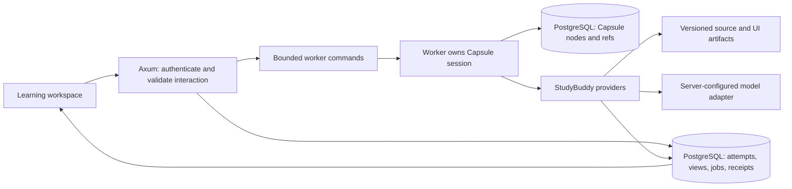

# Capsule integration: first compatibility slice

September 29, 2026. Tested against Capsule `fc6df20d140a58a87ab52645ac9fa77046a3e095` and StudyBuddy `3900c026ec9020c60261f603d9dfde84fc900fd3`. Capsule is advancing independently; the probe pins its tested revision. This updates the September 25 readiness assessment in the [preparation plan](preparation-plan.md).

## Outcome and scope

The current public SDK supports the first learning operator. The [compatibility probe](../experiments/capsule-operator/README.md) exercises a capsule-owned teaching loop, publication before a learner wait, reopen/resume, duplicate-start handling, workspace scope enforcement, and uncertain-publication reconciliation. It uses scripted model replies and in-memory records. It is not connected to Axum, PostgreSQL, a real model, or the frontend; it does not establish teaching quality or crash durability.

Keep the [personal operator design](operator-design.md): the operator develops a harness around the learner's goals. The first supplied verbs are a foothold for that harness, not a permanent quiz-only product. PostgreSQL retains accepted learning evidence and publications; Capsule records the operator's execution.

## What has changed in Core

| Capability | Inspected implementation | Integration consequence |
| --- | --- | --- |
| Park, reopen, resolve | Public `Session::pending`, `resolve`, `Answer`, `Outcome` | A learner can leave and later answer the same pending interaction. |
| Input deduplication | `Session::run_once` and `RunError::InputConflict` | Starting a logical action twice need not invoke the model twice. |
| Unknown delivery | `Reply::Unknown`, `Park::uncertain`, observation resolution | Reconcile a committed domain receipt instead of blindly repeating an effect. |
| Model tool proposals | Capsule-language `offer` and `act`; host `Claude` adapter | Put the teaching loop in the capsule, with explicit verbs and authority checks. |
| Provider routing | Public `Router`, `Question::Route`, recorded decisions | Choose which provider serves a capability. This is distinct from the capsule selecting teaching actions. |
| Local file records | Reference host `FileStorage` | Useful for single-process experiments; its source explicitly excludes cross-process atomic CAS and power-loss durability. |
| Confined code execution | Reference host container provider now exists | Evaluate a StudyBuddy-specific runner policy later; this probe grants no code execution. |

Use the exported SDK, not the aspirational `loop_`/`Stop` sketches still present in the contract. The implementation surface is `run`, `run_once`, `start`/`step`, `provide`, `pending`, and `resolve`.

## Proposed host boundary

`Session` contains provider/router trait objects without `Send` bounds; the reference Claude provider also uses `Rc`. Construct, reopen, and operate each session inside its owning worker thread. Do not place `Session` in Axum's shared state or construct it on one thread and move it into `spawn_blocking`. Move command/result DTOs across the boundary. A bounded worker can own multiple idle parked sessions; one dedicated OS thread per learner is not required.

Core `Storage` and `Provider` are synchronous. The initial adapter can run on a dedicated ordinary thread and use a Tokio runtime handle to await SQLx/provider operations there, while the async runtime remains alive. Verify this bridge with a real database before adopting it. Bound active work, provider timeouts, and model calls; an HTTP request should receive a durable job/interaction identity rather than wait for an entire learning session.

Bind learner and workspace identity from authenticated application state. Build the environment and capsule scope from trusted workspace identifiers, and bind provider database queries to that same ownership context. Model arguments cannot choose credentials, database tenant, environment grants, or arbitrary root forms. Scope enforcement complements application authorization; the probe does not test HTTP authentication.

## Persistence and recovery contracts

The next storage slice should implement public `Storage` in StudyBuddy infrastructure and use the existing SQLx/PostgreSQL foundation. Its proposed records are immutable Capsule node envelopes, compare-and-swap refs, and workspace/session bindings that pin the SDK revision, environment, and capsule. Application artifacts remain separate from core nodes; keep the SDK's canonical node representation and `cas_address` vocabulary.

Preserve parent-first node publication and atomic conditional ref updates. Initial operation needs one owned writer for each session. Multiple workers/processes require an ownership/fencing protocol covering both record updates and provider commits; ref CAS alone does not establish exclusive ownership of an in-flight external effect. No such storage adapter, schema, or locking protocol is implemented by this slice.

Publish an activity before waiting for an answer. `Park` publicly exposes frame, family, digest, and uncertainty, but not request operands or prompt text. The UI reads the accepted activity from PostgreSQL. The host must persist/bind the active activity revision to its learner interaction and pending effect; do not scrape a rendered prompt from the core transcript or assume a park itself is a UI specification.

An answer endpoint should validate learner, workspace, active activity revision, pending effect, and client submission key. Commit the immutable attempt and assistance markers before resolving the learner wait. A retry reads the accepted receipt. Resolving an already answered park produces `NotPending`; that is not sufficient by itself to decide whether two HTTP submissions were identical. The first probe passes bare answer text only to demonstrate the SDK boundary.

Each state-changing provider returns a versioned receipt keyed by `Effect::id()`. A provider commit and Core's reply append remain separate crash boundaries. On uncertain delivery, look up the receipt and resolve with the observed result. Do not use `Interrupt::Allow` as a generic automatic retry. For external model calls without guaranteed idempotency or response lookup, uncertain delivery stays uncertain until an explicit recovery policy settles it.

`run_once` deduplicates starts; it does not promise the latest UI view or a completed run's final projection. In this SDK, a duplicate returns the historical run entry associated with its start, while resolution creates subsequent run entries. Serve current activity/job state from the application's projections.

## SDK bug found

[Core issue #284](https://github.com/Prominent-Systems/capsule-corp/issues/284): `resolve(Answer::Observe(Reply::Value(...)))` rejects object and fractional-number replies accepted by ordinary providers. Confirmed with a minimal example, including successful direct replay and null/list controls. The current v0 observation encoding goes through run operands; the issue requests a recovery/API ruling for this asymmetry.

The probe uses `["publication.v1", effect_id, path, revision]` receipts so reconciliation works through today's API. This is a temporary boundary encoding, not a request to represent the database as lists. Do not silently stringify existing JSON receipts: the returned type and canonical bytes would change. Recheck this workaround when the upstream issue is resolved. **Resolved 2026-09-30; see "Revisit after Phase 1" below.**

## First lesson and verified behavior

The fixture presents the original reward-versus-return exercise from the preparation plan. Its scripted model asks a question; `learning/present` accepts the activity before `learner/answer` parks. After reopening, the learner says they chose A because its immediate reward is higher. The next model request includes that explanation, and a scripted proposal asks them to compute both returns. No grade or mastery update occurs.

Three integration tests pass against the pinned public SDK:

1. Present → wait → reopen → answer → follow-up → finish; completed replay invokes no providers, duplicate start appends nothing, conflicting input and repeated resolution are rejected.
2. A model proposes presentation in another workspace; the run is refused before the publication provider executes.
3. Publication reports unknown delivery after a simulated commit; reopen preserves the effect identity, and observing the existing receipt completes the run without repeating publication.

The publication receipts in these tests are in memory. They do not prove SQL transaction behavior, multi-process ownership, receipt authorization, or recovery after a real process kill. Model outputs are scripted; carrying a learner explanation forward is not evidence of intelligent adaptation.

## Revisit after Phase 1 (#17, 2026-10-01)

Phase 1 closed on 2026-10-01 (gate record: [gate-demo.md](gate-demo.md)). This section re-checks the two upstream issues, picks the SDK revision and the adapter shape for Phase 2, and amends the earlier proposals above where Core moved under them. Checked against capsule-corp `main` at `4b77dcce4de6efd8d81b0c671a33851ce353918a` (2026-10-01 20:04 UTC, after PR #302 merged; 41 commits after the probe's pin) by reading `.active/CURRENT.md`, `.active/sdk-surface-v1.md`, `src/sdk.rs`, `src/session/door.rs` and `host/src/storage.rs`, and by compiling and running the probe against it.

### Upstream status

| Issue | Status on 2026-10-01 | What it means here |
| --- | --- | --- |
| [#284](https://github.com/Prominent-Systems/capsule-corp/issues/284) `Observe` rejects object and float replies | **Closed.** Fixed by PR #288 (merged 2026-09-30, `15aabf86`). Ruled in sdk "Parks and the one downward door": an observation is recorded as the reply it stands in for, so whatever a provider may reply a host may observe, and the run comes to the same value either way. | The tagged-list receipt workaround in the probe is no longer needed. Receipts can be the JSON objects the application already has. |
| [#287](https://github.com/Prominent-Systems/capsule-corp/issues/287) async hosting and durable handoff | **Open, triaged** into `.active/CURRENT.md` Checkpoint 4E as four pieces. **H1** (the park is the whole request) and **H1b** (complete by effect id, idempotent) are done, merged in PR #291 on 2026-09-30. **H2** (a session owner for async hosts: one thread, a clonable `Send + Sync` handle, bounded channel, accepted-command identity) merged in PR #301 on 2026-10-01, host code only, as `capsule_host::owner::{Owner, Handle, Ticket, Gone}`. **T2** (the timekeeper, a durable queue of wakes keyed by effect id, long-polled by the owner) merged in PR #300 the same day. **H3** (the park authorizes dispatch; completion is bound to the id) is **ruled** in PR #302 on 2026-10-01: the park is the one transition that authorizes a host to perform an effect outside the session, a paused effect is not, and cancellation is defined at each of the four crash points (before dispatch: deny; during possible delivery: `Unknown`, then complete from the receipt or `Allow` under the same id; after the domain commit: complete from the receipt; after the reply is recorded: `Already`). A late completion after revocation is `Abandoned` and the act stands outside the record. **H4** (SQLx `Storage` over `PgPool`) **shipped** in the same PR, taken back into the sprint because #287 was waiting on it: `capsule_host::postgres::PgStorage` behind the `postgres` feature, two tables (`nodes`, never updated; `refs`, moved by one conditional statement), each write its own committed transaction, conformance-tested with `CAPSULE_PG_URL`; the value owns a small Tokio runtime and blocks on it, so it is used from a plain thread such as the owner's, never inside a Tokio worker. Upstream runs casd itself and calls `PgStorage` "what a deployment that already has a Postgres writes". | All four requested capabilities are met on `main`. #287 stays open as the inbox. |

### SDK revision for Phase 2

Pin capsule-corp **`4b77dcce4de6efd8d81b0c671a33851ce353918a`** (`main`, 2026-10-01). It carries the Observe fix, H1/H1b, the H3 ruling, `HttpStorage` and `PgStorage`, the clock-source park (T1), the timekeeper (T2), the session owner (H2), wide delegation and sibling messages (D4a, D4b, D5). The probe's three tests compile and pass against it **with no source change** (the `Session`, `run_once`, `pending`, `resolve`, `Answer`, `Reply`, `Outcome` surface the probe uses is intact); bumping the probe's pin and lockfile is the first commit of #18. The session owner the Axum host stands on is in this pin, so the dedicated-thread rule in "Proposed host boundary" above is now implemented upstream rather than by us.

What the pinned SDK adds that the probe does not yet use, and that Phase 2 will:

| Surface | Replaces | Use |
| --- | --- | --- |
| `Park::effect()`: the `Effect` as a provider would be given it (`id`, `capability`, `payload`), plus `run()`, `origin()`, `name()`, `uncertain()`, the same live and after reopen | Reading request operands off a private form, or keeping the only copy of a request in a provider closure | The host reads what it owes off `pending()` and keys receipts by `Effect::id()`. |
| `Session::complete(&id, reply)` with `Completed::Recorded` / `Completed::Already`, `RunError::Completed` for a conflicting value, `NotPending`, `Abandoned` | `resolve(&park, Answer::Observe(..))` by digest, and the probe's list-shaped receipt | The answer endpoint and the recovery path both complete by effect id; a retry is `Already`, a conflicting completion is refused by name. |
| `pending()` versus `paused()` versus `uncertain` | Guessing whether an effect happened | The host never retries a `paused` or `uncertain` effect; it looks up its receipt and completes. |
| `clock/at` as a source family: a sleep is a park whose operand is the deadline | Any in-process timer | Spaced follow-ups later become wakes completed by a timekeeper (T2); not needed for the first loop. |

### Adapter shape decisions

1. **Record store: PostgreSQL through `capsule_host::postgres::PgStorage`, with casd as the fallback.** This amends [persistence-design.md](persistence-design.md) in the other direction from what it proposed: the operator's nodes and refs do live in PostgreSQL, but in upstream's conformance-tested port, not in an adapter we write. StudyBuddy already runs one database, its migrations already own the schema, and the tests already run against the disposable container; a second service that must be built from a private repository is a cost with no benefit at one deployment. Two tables in a `capsule` schema, created by our migration and opened with `PgStorage::existing` so the application never lets a library create tables. PostgreSQL also keeps what it holds today: learners, activities, revisions, attempts, assessments, artifacts, and the new provider receipts keyed by effect id. The operator's record and the application's records are in one database but never in one transaction; the crash boundary this document names stays where it is, and the receipt table is how the two are reconciled.
   - *Where it runs.* `PgStorage` owns its own small runtime and blocks on it, so it lives on the session owner's thread (H2) with a pool of its own; the application's `PgPool` on the Tokio runtime is untouched. It is never called from a handler.
   - *Fallback.* casd through `capsule_host::HttpStorage` (verified locally on 2026-10-01: built from source, its suite and golden vectors pass, nodes and refs behave as documented, the record survives a restart) is what a deployment that wants the record outside its database, or several processes over one record, switches to. The two ports conform to the same suite, so the switch is one line in the owner's open closure and no change to providers or the loop. Writing a third store is not on the table.
   - *Ownership.* Ref compare-and-swap fences the record, not an in-flight provider write; one owner per session is the application's rule, enforced in #18 by a per-workspace lease row in PostgreSQL that the owner thread holds.

2. **Session ownership: `capsule_host::owner::Owner` and `Handle` (H2, merged).** `Owner::spawn` takes a closure that opens or reopens the session on the owning thread, installing providers and router there, so nothing a provider holds has to be `Send`. Axum state holds a `Handle` clone, which offers `run_once`, `complete`, `pending`, `paused`, `abandoned`, `runs`, `inspect` and a generic `submit`; each returns a `Ticket` whose `wait` is blocking, so an async handler calls it inside `spawn_blocking`. A command is accepted when it is in the bounded channel and runs whether or not the HTTP future is still waiting, which is exactly the "durable job identity, not a long wait" rule above; `Gone` distinguishes an owner stopped on purpose from one that died by panic, and the record decides a retry. `Handle::keep_time` runs the timekeeper loop for clock parks. StudyBuddy writes no actor of its own.

3. **Completion and recovery: by effect id, through `complete`.** Each state-changing provider (`learning/present`, later `learner/answer`) commits its domain row and a receipt row `(effect_id, session, kind, payload JSON)` in one PostgreSQL transaction, then returns the receipt JSON as its reply. After any crash, the owner reads `pending()`, looks each `Park::effect().id()` up in the receipt table, and calls `complete`; a missing receipt on an `uncertain` park is "the effect did not commit" and is re-performed only by an explicit policy, never automatically. The probe's `["publication.v1", ...]` encoding is retired with its pin bump.

4. **Model access: the server-configured adapter from #6.** The `LlmClient` behind `/api/llm/proxy` is the only model transport; the capsule's model provider calls it from the owner thread through a runtime handle. No credentials, base URL or model name reach the capsule or the record.

5. **Scope: a workspace is an environment, built from trusted ids.** Unchanged from above. The environment grants `learning/*` and `learner/*` scoped to `workspaces/<id>/*` where `<id>` comes from the authenticated request, never from the model.

### Consequences for the Phase 2 tickets

- **#18** becomes: pin bump; the `capsule` schema migration (`nodes`, `refs`) and the receipt and lease tables; open and reopen a StudyBuddy session on `PgStorage::existing` against the disposable database from an owner thread; a kill test through the four crash points (before dispatch, during possible delivery, after the domain commit, after the reply is recorded) completing from receipts. No storage adapter of our own, and no casd in the default development setup.
- **#19** is unchanged in intent: providers call the same `ActivityService` and `AttemptService` the routes do, so ownership, revision rules, transactions and receipts are shared and there is no second publication or grading path.
- **#20** gains `complete` by effect id and loses the list receipt; the adapter is the one from #6.

## Implementation order after the hardening decision

The owner has selected [StudyBuddy cleanup and hardening first](hardening-plan.md). That plan supersedes the earlier storage-adapter-first sequence. The compatibility probe remains isolated while the application gains a correct persisted learning flow.

1. Establish the application baseline, address ownership/configuration gaps, and verify activity revisions, attempts, receipts, source versions, and refresh/retry behavior without an operator.
2. Revisit the supported SDK, implement Capsule storage and its host boundary, and expose the same hardened application operations as providers. Track [async hosting request #287](https://github.com/Prominent-Systems/capsule-corp/issues/287) and [recovery bug #284](https://github.com/Prominent-Systems/capsule-corp/issues/284).
3. Connect one real operator learning loop; verify reopen and receipt reconciliation against the actual persistence adapter.
4. Expand source research, Anki exports, code/artifacts, and dynamic interface composition as separate reviewable slices.

Each implementation/test diff stops at the owner's review checkpoint. Capsule source is not changed by this integration work.

## Contract and source references

- [SDK contract](https://github.com/Prominent-Systems/capsule-corp/blob/fc6df20d140a58a87ab52645ac9fa77046a3e095/.active/sdk-surface-v1.md): “The box”, “The language” (`offer`/`act`), “The record”, “Parks and the one downward door”, “Providers”.
- [Authority algebra](https://github.com/Prominent-Systems/capsule-corp/blob/fc6df20d140a58a87ab52645ac9fa77046a3e095/.active/authority-algebra-v0.md): “Emergent capabilities: programs, not authority”, “Routing sits on top”, “The substrate: CAS nodes”, and “Open” (compaction).
- [Public exports](https://github.com/Prominent-Systems/capsule-corp/blob/fc6df20d140a58a87ab52645ac9fa77046a3e095/src/sdk.rs), [session](https://github.com/Prominent-Systems/capsule-corp/blob/fc6df20d140a58a87ab52645ac9fa77046a3e095/src/session.rs), [provider and park types](https://github.com/Prominent-Systems/capsule-corp/blob/fc6df20d140a58a87ab52645ac9fa77046a3e095/src/session/door.rs), [file store](https://github.com/Prominent-Systems/capsule-corp/blob/fc6df20d140a58a87ab52645ac9fa77046a3e095/host/src/storage.rs), and [reference agent capsule](https://github.com/Prominent-Systems/capsule-corp/blob/fc6df20d140a58a87ab52645ac9fa77046a3e095/host/examples/editor.capsule).
