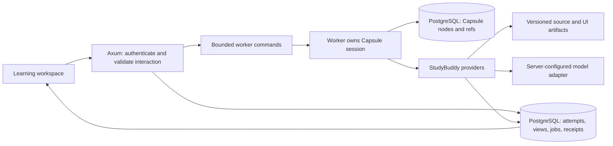

# Capsule integration: first compatibility slice

September 29, 2026. Tested against Capsule `fc6df20d140a58a87ab52645ac9fa77046a3e095` and StudyBuddy `3900c026ec9020c60261f603d9dfde84fc900fd3`. Capsule is advancing independently; the probe pins its tested revision. This updates the September 25 readiness assessment in the [preparation plan](preparation-plan.md).

## Outcome and scope

The current public SDK supports the first learning operator. The [compatibility probe](../experiments/capsule-operator/README.md) exercises a capsule-owned teaching loop, publication before a learner wait, reopen/resume, duplicate-start handling, workspace scope enforcement, and uncertain-publication reconciliation. It uses scripted model replies and in-memory records. It is not connected to Axum, PostgreSQL, a real model, or the frontend; it does not establish teaching quality or crash durability.

Keep the [personal operator design](operator-design.md): the operator develops a harness around the learner's goals. The first supplied verbs are a foothold for that harness, not a permanent quiz-only product. PostgreSQL retains accepted learning evidence and publications; Capsule records the operator's execution.

## What has changed in Core

| Capability | Inspected implementation | Integration consequence |
| --- | --- | --- |
| Park, reopen, resolve | Public `Session::pending`, `resolve`, `Answer`, `Outcome` | A learner can leave and later answer the same pending interaction. |
| Input deduplication | `Session::run_once` and `RunError::InputConflict` | Starting a logical action twice need not invoke the model twice. |
| Unknown delivery | `Reply::Unknown`, `Park::uncertain`, observation resolution | Reconcile a committed domain receipt instead of blindly repeating an effect. |
| Model tool proposals | Capsule-language `offer` and `act`; host `Claude` adapter | Put the teaching loop in the capsule, with explicit verbs and authority checks. |
| Provider routing | Public `Router`, `Question::Route`, recorded decisions | Choose which provider serves a capability. This is distinct from the capsule selecting teaching actions. |
| Local file records | Reference host `FileStorage` | Useful for single-process experiments; its source explicitly excludes cross-process atomic CAS and power-loss durability. |
| Confined code execution | Reference host container provider now exists | Evaluate a StudyBuddy-specific runner policy later; this probe grants no code execution. |

Use the exported SDK, not the aspirational `loop_`/`Stop` sketches still present in the contract. The implementation surface is `run`, `run_once`, `start`/`step`, `provide`, `pending`, and `resolve`.

## Proposed host boundary

`Session` contains provider/router trait objects without `Send` bounds; the reference Claude provider also uses `Rc`. Construct, reopen, and operate each session inside its owning worker thread. Do not place `Session` in Axum's shared state or construct it on one thread and move it into `spawn_blocking`. Move command/result DTOs across the boundary. A bounded worker can own multiple idle parked sessions; one dedicated OS thread per learner is not required.

Core `Storage` and `Provider` are synchronous. The initial adapter can run on a dedicated ordinary thread and use a Tokio runtime handle to await SQLx/provider operations there, while the async runtime remains alive. Verify this bridge with a real database before adopting it. Bound active work, provider timeouts, and model calls; an HTTP request should receive a durable job/interaction identity rather than wait for an entire learning session.

Bind learner and workspace identity from authenticated application state. Build the environment and capsule scope from trusted workspace identifiers, and bind provider database queries to that same ownership context. Model arguments cannot choose credentials, database tenant, environment grants, or arbitrary root forms. Scope enforcement complements application authorization; the probe does not test HTTP authentication.

## Persistence and recovery contracts

The next storage slice should implement public `Storage` in StudyBuddy infrastructure and use the existing SQLx/PostgreSQL foundation. Its proposed records are immutable Capsule node envelopes, compare-and-swap refs, and workspace/session bindings that pin the SDK revision, environment, and capsule. Application artifacts remain separate from core nodes; keep the SDK's canonical node representation and `cas_address` vocabulary.

Preserve parent-first node publication and atomic conditional ref updates. Initial operation needs one owned writer for each session. Multiple workers/processes require an ownership/fencing protocol covering both record updates and provider commits; ref CAS alone does not establish exclusive ownership of an in-flight external effect. No such storage adapter, schema, or locking protocol is implemented by this slice.

Publish an activity before waiting for an answer. `Park` publicly exposes frame, family, digest, and uncertainty, but not request operands or prompt text. The UI reads the accepted activity from PostgreSQL. The host must persist/bind the active activity revision to its learner interaction and pending effect; do not scrape a rendered prompt from the core transcript or assume a park itself is a UI specification.

An answer endpoint should validate learner, workspace, active activity revision, pending effect, and client submission key. Commit the immutable attempt and assistance markers before resolving the learner wait. A retry reads the accepted receipt. Resolving an already answered park produces `NotPending`; that is not sufficient by itself to decide whether two HTTP submissions were identical. The first probe passes bare answer text only to demonstrate the SDK boundary.

Each state-changing provider returns a versioned receipt keyed by `Effect::id()`. A provider commit and Core's reply append remain separate crash boundaries. On uncertain delivery, look up the receipt and resolve with the observed result. Do not use `Interrupt::Allow` as a generic automatic retry. For external model calls without guaranteed idempotency or response lookup, uncertain delivery stays uncertain until an explicit recovery policy settles it.

`run_once` deduplicates starts; it does not promise the latest UI view or a completed run's final projection. In this SDK, a duplicate returns the historical run entry associated with its start, while resolution creates subsequent run entries. Serve current activity/job state from the application's projections.

## SDK bug found

[Core issue #284](https://github.com/Prominent-Systems/capsule-corp/issues/284): `resolve(Answer::Observe(Reply::Value(...)))` rejects object and fractional-number replies accepted by ordinary providers. Confirmed with a minimal example, including successful direct replay and null/list controls. The current v0 observation encoding goes through run operands; the issue requests a recovery/API ruling for this asymmetry.

The probe uses `["publication.v1", effect_id, path, revision]` receipts so reconciliation works through today's API. This is a temporary boundary encoding, not a request to represent the database as lists. Do not silently stringify existing JSON receipts: the returned type and canonical bytes would change. Recheck this workaround when the upstream issue is resolved.

## First lesson and verified behavior

The fixture presents the original reward-versus-return exercise from the preparation plan. Its scripted model asks a question; `learning/present` accepts the activity before `learner/answer` parks. After reopening, the learner says they chose A because its immediate reward is higher. The next model request includes that explanation, and a scripted proposal asks them to compute both returns. No grade or mastery update occurs.

Three integration tests pass against the pinned public SDK:

1. Present → wait → reopen → answer → follow-up → finish; completed replay invokes no providers, duplicate start appends nothing, conflicting input and repeated resolution are rejected.
2. A model proposes presentation in another workspace; the run is refused before the publication provider executes.
3. Publication reports unknown delivery after a simulated commit; reopen preserves the effect identity, and observing the existing receipt completes the run without repeating publication.

The publication receipts in these tests are in memory. They do not prove SQL transaction behavior, multi-process ownership, receipt authorization, or recovery after a real process kill. Model outputs are scripted; carrying a learner explanation forward is not evidence of intelligent adaptation.

## Implementation order after the hardening decision

The owner has selected [StudyBuddy cleanup and hardening first](hardening-plan.md). That plan supersedes the earlier storage-adapter-first sequence. The compatibility probe remains isolated while the application gains a correct persisted learning flow.

1. Establish the application baseline, address ownership/configuration gaps, and verify activity revisions, attempts, receipts, source versions, and refresh/retry behavior without an operator.
2. Revisit the supported SDK, implement Capsule storage and its host boundary, and expose the same hardened application operations as providers. Track [async hosting request #287](https://github.com/Prominent-Systems/capsule-corp/issues/287) and [recovery bug #284](https://github.com/Prominent-Systems/capsule-corp/issues/284).
3. Connect one real operator learning loop; verify reopen and receipt reconciliation against the actual persistence adapter.
4. Expand source research, Anki exports, code/artifacts, and dynamic interface composition as separate reviewable slices.

Each implementation/test diff stops at the owner's review checkpoint. Capsule source is not changed by this integration work.

## Contract and source references

- [SDK contract](https://github.com/Prominent-Systems/capsule-corp/blob/fc6df20d140a58a87ab52645ac9fa77046a3e095/.active/sdk-surface-v1.md): “The box”, “The language” (`offer`/`act`), “The record”, “Parks and the one downward door”, “Providers”.
- [Authority algebra](https://github.com/Prominent-Systems/capsule-corp/blob/fc6df20d140a58a87ab52645ac9fa77046a3e095/.active/authority-algebra-v0.md): “Emergent capabilities: programs, not authority”, “Routing sits on top”, “The substrate: CAS nodes”, and “Open” (compaction).
- [Public exports](https://github.com/Prominent-Systems/capsule-corp/blob/fc6df20d140a58a87ab52645ac9fa77046a3e095/src/sdk.rs), [session](https://github.com/Prominent-Systems/capsule-corp/blob/fc6df20d140a58a87ab52645ac9fa77046a3e095/src/session.rs), [provider and park types](https://github.com/Prominent-Systems/capsule-corp/blob/fc6df20d140a58a87ab52645ac9fa77046a3e095/src/session/door.rs), [file store](https://github.com/Prominent-Systems/capsule-corp/blob/fc6df20d140a58a87ab52645ac9fa77046a3e095/host/src/storage.rs), and [reference agent capsule](https://github.com/Prominent-Systems/capsule-corp/blob/fc6df20d140a58a87ab52645ac9fa77046a3e095/host/examples/editor.capsule).
