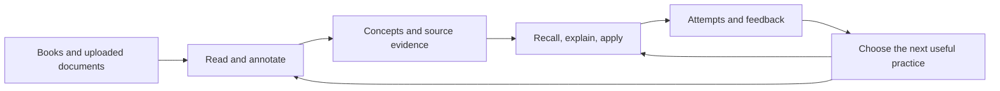

# StudyBuddy: the learning experience

Status: proposed design, September 25, 2026. No application changes implemented.

Product direction: each learner gets a personal operator that constructs and maintains a learning harness. Start with the [operator contract](operator-design.md) and [preparation plan](preparation-plan.md). This document describes the learning experience within that system.

The first pilot is the owner's thesis-style RL project, beginning with Sutton and Barto Chapter 1. Organic chemistry exam preparation is a second reference journey, with default Anki exports. The owner has authorized substantial redesign and removal of unnecessary code.

## What the website should do

The personal operator turns the learner's goal into a continuing cycle of study, creation, retrieval, application, and correction. On returning, the learner can resume an experiment, reading passage, or review session, with a useful next action chosen for their current work.

The objective is durable recall and the ability to solve unfamiliar problems within a chosen study-time budget. We cannot claim an optimal teaching policy before measuring those outcomes. Engagement, time on site, and immediate quiz accuracy are secondary signals.

## Stable navigation, generated workspaces

These are initial navigation destinations, not fixed layouts for every learner. The operator can compose and publish different activities and interfaces inside them. In a thesis workspace, research and artifacts may dominate; in an exam workspace, daily practice and deck exports may dominate.

| Screen | Main interaction | Useful outcome |
|---|---|---|
| Today | Start a session that fits the available time | Review due material, revisit a misconception, attempt an application |
| Reader | Read with a collapsible concept and research sidebar | Keep source context while finding explanations and connections |
| Practice | Attempt, optionally request a hint, receive feedback | Produce evidence about a specific learning objective |
| Knowledge | Browse concepts, prerequisites, sources, and prior attempts | See what has been encountered, demonstrated, or left uncertain |

During reading, the source gets the largest area of the screen. On narrow screens, contextual material becomes a separate panel. Questions appear at chosen section boundaries or when requested. Reading should remain uninterrupted by default. Keyboard access, adjustable text, and an accessible text alternative to a graph belong in the basic interface. Custom activities retain a predictable route back to the source and prior work.

A proposed Today screen might show:

> **Reinforcement learning · 15 minutes available**
>
> Review 4 due cards · revisit reward versus value · try 1 new scenario
>
> **Start practice** · Continue Chapter 1

Those counts illustrate a session, not an experimentally established optimum. The session is saved before it starts and can resume after refresh.

## Track concepts without creating endless homework

Build a reviewable concept map from the document's sections, claims, examples, and prerequisites. Link each concept to source passages. Allow merging, splitting, hiding, and correcting the proposed concepts. Show which sections have actually been processed; extraction does not guarantee that every concept was found.

Track learning objectives beneath concepts: define a term, distinguish two ideas, explain a mechanism, derive a result, apply it, or implement it. A single concept can require several kinds of evidence.

Keep these signals distinct:

- **Encountered:** the learner reached or marked the passage. This measures coverage.
- **Recalled:** the learner retrieved information under recorded conditions.
- **Explained:** an answer met specified explanation criteria.
- **Applied:** the learner solved a different example or problem.
- **Needs another check:** evidence is sparse, old, assisted, conflicting, or awaiting assessment.

Display the observations behind these summaries: dates, question versions, hints used, and assessment criteria. Avoid presenting an arbitrary score as a calibrated probability of understanding. One wrong multi-concept answer should not automatically downgrade every linked concept.

## Sutton and Barto as the first worked example

Begin with agent/environment interaction, policy, reward, value, models, and exploration. This is a proposed concept set; validate it against the actual uploaded edition and passages before publishing questions. No page citations have been invented here.

For the objective **distinguish immediate reward from longer-term value**, create:

| Activity | Original example prompt | Evidence sought |
|---|---|---|
| Recall | What does a policy specify? | Retrieval of the concept's meaning |
| Explain | How can an action with a smaller immediate reward still be preferable? | Reasoning about future consequences |
| Apply | A robot can earn 2 now and stop, or earn 0 now and certainly earn 5 next step. With no discounting or other costs, which choice has greater return? | Applying an explicitly defined objective |
| Diagnose | A learner says, “A policy is a table of how good every action is.” What distinction is missing? | Distinguishing a choice rule from action values |

The tutor first invites an attempt. Hints, source lookup, and full explanations remain available, and their use is recorded. A helped answer is useful practice; later unaided attempts provide different evidence.

## Fresh daily practice and Anki

Combine two mechanisms:

1. **Stable recall cards:** persistent item IDs, explicit recall ratings, and a versioned spaced-repetition scheduler. FSRS is a reasonable implementation candidate for this use [7].
2. **Concept practice:** vetted question variants, explanations, comparisons, and new applications. Store each variant and its rubric as a separate revision linked to its objectives.

Freshness comes from the daily selection and some new applications. Repeated retrieval of important material remains intentional. A reworded question is not automatically equivalent in difficulty, and several sibling questions in one sitting are not independent demonstrations of mastery.

Initially select due recall items, unresolved misconceptions, and a small amount of new/application work within the learner's time budget. Keep the rule inspectable and allow skipping or shortening the session. Pre-generate and validate a question bank so logging in does not wait on an LLM.

Anki export is a default capability, particularly prominent in the exam journey. Target a packaged deck with necessary media plus a transparent text export containing stable external IDs, prompts, answers, source references, and concept tags [8]. See the [export contract](operator-design.md#default-exports-and-ownership-of-the-work) for package/update requirements. Export alone does not synchronize review histories. Let the learner choose which system schedules an exported card; mark Anki-managed cards as externally reviewed with unknown current status until history import exists.

## Research while reading

Use two explicit scopes:

- **My library:** retrieve relevant passages from uploaded documents, including alternate explanations and prerequisite material. Every substantive sourced explanation links back to its document version and location.
- **Further reading:** optional web research for a selected question or concept. Label external material separately, with source, date, publication status, and its relation to the current reading.

A background job can prepare connections for the current section and the next section. Save suggestions in the sidebar rather than continually interrupting. Keep searching within a bounded document/section scope and a configurable generation budget.

Pipeline: preserve source bytes → extract page-aware text → propose concepts and objectives → retrieve supporting spans → draft items/rubrics → validate references and answerability → publish accepted items. Failed extraction and unsupported questions stay visible as incomplete work. A second model's agreement is supporting review, not ground truth.

## Technical direction

Keep React/TypeScript, Axum, and the domain/application/infrastructure separation where they support the personal operator. Capsule supplies the governed execution and record for its evolving harness. The host supplies learning capabilities, persistence, and rendering. Redesign those boundaries in [the persistence proposal](persistence-design.md) and integrate against the [readiness criteria](preparation-plan.md#capsule-integration-dependencies). Add search over indexed passages when the basic source-to-question path works; embedding indexes should be rebuildable from source revisions and encoder versions.

Use interchangeable model providers for extraction, question drafting, and feedback. Save the actual accepted outputs and their provenance. Exact model/pricing choices are deferred until a small quality evaluation exists.

## How we will know it helps

For the first chapter, manually review a small set of concepts, questions, source links, and scoring criteria. Study through the complete loop before expanding extraction to an entire book.

Evaluate delayed unaided recall and new application problems at preselected follow-up times, alongside study time, grading disagreements, and defective generated items. Hold evaluation questions out of tutoring context. Compare against ordinary reading plus a fixed review deck at a similar time budget. A personal trial informs product decisions but does not establish a population-wide effect.

Later research could test whether misconception-aware question selection improves delayed transfer. Synthetic learners can exercise software and algorithms; their results cannot establish gains for real learners. Knowledge tracing predicts performance, while an instructional policy chooses an intervention. Better prediction alone does not prove better instruction [5, 6].

## Evidence informing the design

Checked September 25, 2026. Product choices above are proposals, not results established by these publications.

| Source | Evidence and inspection level | Design implication and limit |
|---|---|---|
| [1. Dunlosky et al., 2013, Psychological Science in the Public Interest](https://www.psychologicalscience.org/publications/journals/pspi/learning-techniques.html) | Research review; publisher summary inspected | Practice testing and distributed practice received high utility ratings. This supports the basic cycle, not a particular interface or scheduler. |
| [2. Carpenter, Pan and Butler, 2022, Nature Reviews Psychology](https://doi.org/10.1038/s44159-022-00089-1) | Review; publisher summary and [author manuscript](https://sc-pan.github.io/pdf/NRP_2022.pdf) accessed; not a full methods audit | Use spacing and retrieval, and explain why effortful practice can feel less fluent than rereading. |
| [3. Bastani et al., 2025, PNAS](https://doi.org/10.1073/pnas.2422633122) | Randomized high-school mathematics study; reported methods/results inspected | Unrestricted assistance improved assisted performance but harmed later unaided performance in this setting. The tutor condition mitigated that harm without establishing superiority on the unaided exam. Measure learning after help is removed. |
| [4. Kestin et al., 2025, Scientific Reports](https://www.nature.com/articles/s41598-025-97652-6) | Randomized college-physics study; publisher abstract and indexed study description inspected | A deliberately designed AI tutor improved learning in the studied setting. This does not establish long-term benefits across all subjects or validate this app. |
| [5. Piech et al., 2015, NeurIPS](https://proceedings.neurips.cc/paper_files/paper/2015/hash/bac9162b47c56fc8a4d2a519803d51b3-Abstract.html) | Peer-reviewed conference paper; official abstract inspected | Background for learned knowledge tracing. Predictive performance is distinct from measured educational benefit. |
| [6. Choffin, Popineau and Bourda, 2021, Journal of Educational Data Mining](https://jedm.educationaldatamining.org/index.php/JEDM/article/view/510) | Journal paper; abstract and indexed model passages inspected | Multi-skill scheduling is relevant to application questions. The reported scheduling comparison uses simulated students, a material limitation for product claims. |
| [7. Anki manual: FSRS](https://docs.ankiweb.net/deck-options.html#fsrs) | Official implementation documentation inspected | Scheduling trades retention against review workload. Its card-recall target is not a probability of conceptual mastery. |
| [8. Anki manual: text import](https://docs.ankiweb.net/importing/text-files.html) | Official format documentation inspected | A practical first interoperability path; review-history synchronization is additional work. |

## First useful release

A personal operator for one bounded goal, initially using supplied blocks: a selected chapter, source-linked concepts, a small accepted question bank, persisted attempts, and a follow-up that changes with the learner's response. The exam reference journey adds reliable review scheduling and default Anki export. Start with text/PDF materials; other subjects can add assessment types such as derivations, code, or language production without pretending all learning reduces to cards.

Implementation proceeds through small diffs with the owner's review and explanation at each checkpoint. The preparation plan defines the candidate slices and their Capsule dependencies.
