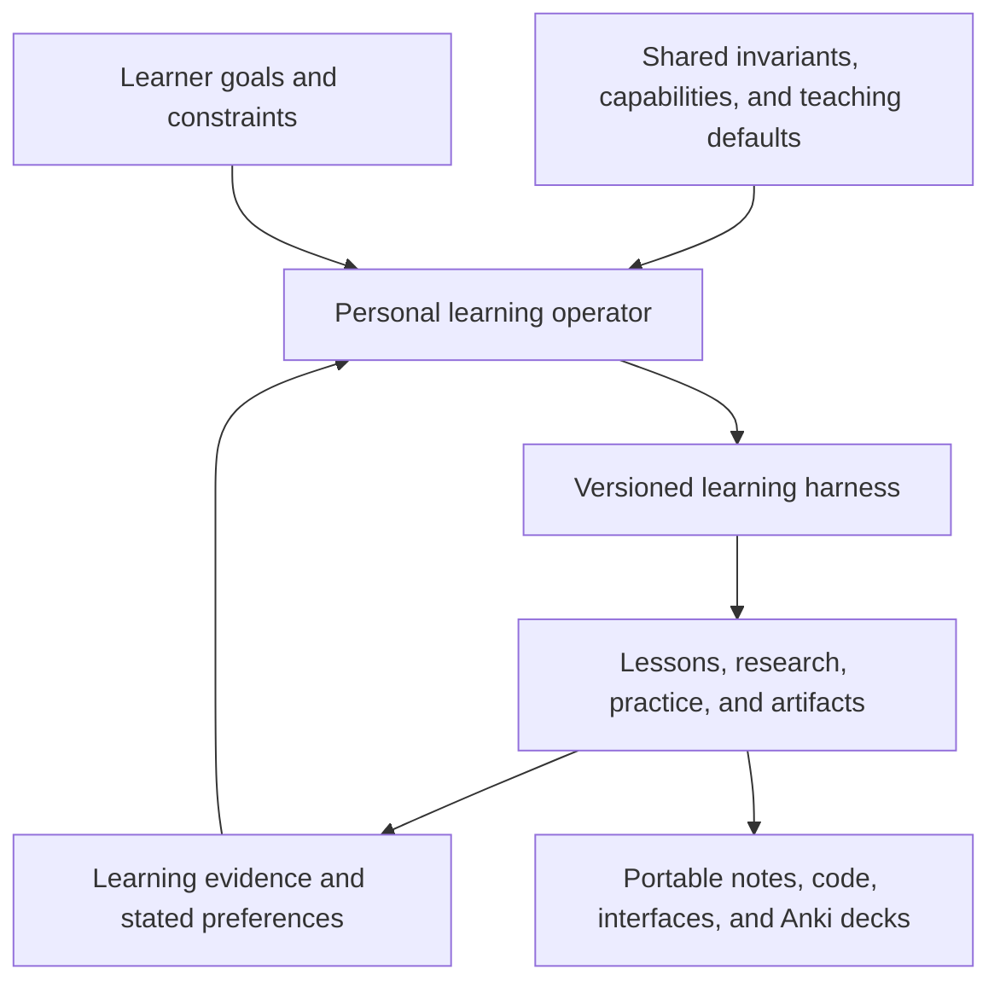

# A personal operator for each learner

Status: product direction agreed in conversation; contracts below are proposals, September 25, 2026. Application integration is not yet implemented; the standalone SDK probe is described in the [September 29 integration assessment](capsule-integration.md).

Start here for the product architecture. The current implementation order is [StudyBuddy hardening, then Capsule integration](hardening-plan.md). Supporting notes: [preparation and Capsule readiness](preparation-plan.md), [learning experience and evidence](learning-design.md), and [persistence](persistence-design.md).

## The product we are building

Each learner has a persistent personal operator that develops and maintains a learning environment around their goals, demonstrated understanding, preferences, and constraints. StudyBuddy supplies invariants, a default teaching approach, and initial building blocks. The operator assembles activities, research workflows, review routines, and interfaces, and can develop additional blocks as the execution platform permits.

The harness is the versioned configuration of those tools, workflows, teaching policies, and interfaces. It can evolve without changing the learner's underlying identity or rewriting their history. It is more substantial than a chat personality or a personalized dashboard.

The first actual learner is the owner, pursuing a thesis-style RL project. Organic chemistry exam preparation is a second reference case for design and evaluation, not a record of another real user's behavior. These are starting points rather than permanent categories.

## Two reference journeys

| Dimension | RL thesis researcher | Organic chemistry exam student |
|---|---|---|
| Goal | Develop and defend a research contribution | Perform well on a specific course's exams |
| Inputs | Papers, textbooks, code, experiment results, advisor feedback | Syllabus, lecture material, reaction families, practice exams |
| Initial environment | Reading and citation workspace, experiment comparisons, code exercises | Daily review, syllabus coverage, recall cards, relevant application problems |
| Operator-created blocks | Return visualizer, derivation exercise, experiment table, reproducibility checklist | Reaction comparison, structure identification, mechanism exercise, deck preview |
| Useful evidence | Explanations, working implementations, controlled results, justified claims | Delayed recall and performance on representative exam problems |
| Default deliverables | Citable Markdown notes, bibliography, code, plots, experiment records | Anki deck, concise notes, error log, study plan tied to exam dates |

The thesis researcher can use Anki for definitions. The exam student may need substantial reasoning practice if the syllabus requires it. The operator uses the goal and observed task performance to choose the mix; neither profile determines a fixed learning style.

## The operator's charter

Help this learner achieve their stated learning goal within their available time, attention, and resource budget. Maintain an inspectable account of what is known, what is uncertain, and why the next activity was selected. Adapt the harness when evidence or the learner's instructions justify a change.

The operator maintains:

- A **goal contract**: desired outcome, scope, deadlines, available time, and what will count as evidence of progress.
- **Learner memory**: stated background/preferences and observed attempts, assistance, assessments, and follow-up results. Keep observations distinct from inferred needs; support correction.
- A **harness revision**: selected workflows, component versions, teaching defaults, and export choices.
- An **artifact library**: sources, accepted notes, cards, code, simulations, and their provenance.
- A **change record**: what changed in the harness, why, what outcome was expected, and what happened afterwards.

The operator chooses among permitted actions and proposes new behavior. The application's trusted host controls grants and the allowed execution environment. “Personal operator” is the product role; it does not give a model authority to grant itself permissions.

## What is fixed and what can adapt

| Shipped guarantee | Where it is enforced |
|---|---|
| Actions stay within granted reach and budgets | Capsule authority/budget checks plus correctly confined host providers |
| Original attempts and accepted content versions remain identifiable | Versioned domain records and artifact persistence |
| Material represented as source-backed has resolvable source references | Publication validation; factual correctness still requires assessment |
| Assisted attempts, pending grades, and unassessed work retain those labels | Learning-event and projection rules |
| A recorded run reopens using recorded external observations | Capsule replay contract |
| Generated views can only invoke declared, authorized actions | Renderer protocol and server-side action validation |
| Exports identify included revisions and omissions | Export manifest validation |

Teaching defaults are adjustable policies: attempt before explanation, graduated hints, spaced recall, application checks, session length, and presentation choices. A mathematical guarantee that the learner understood a concept is not among the invariants. Learning claims require evidence.

The evidence review distinguishes preferences and aptitudes from unsupported fixed learning-style matching: [Pashler and colleagues](https://www.psychologicalscience.org/journals/pspi/j.1539-6053.2009.01038.x/). Personalization should respond to demonstrated needs while honoring accessibility and explicit preferences.

## How the harness evolves

1. Identify a goal-relevant problem: a repeated misconception, an inefficient workflow, a missing explanation, or a requested change.
2. Choose an existing block, compose a new activity, or propose a new block if the available capabilities permit it.
3. Record the intended benefit and the evidence behind the choice. Prefer the smallest useful change; do not redesign the whole workspace on every visit.
4. Validate content, behavior, accessibility, and action boundaries before publishing a new revision.
5. Observe outcomes appropriate to the change. A more usable citation viewer can be assessed through source-finding tasks; a teaching intervention needs later learning evidence.
6. Keep, revise, or roll back the change. Preserve the previous version and permit the learner to pin a preferred workspace.

Routine composition can happen automatically within the chosen settings and budget. New authority remains an environment decision. A successful rendering or enthusiastic click is not sufficient evidence that a lesson improved learning.

## Generated interfaces and reusable blocks

The learner sees a stable way to resume work, find their library, inspect memory, and export. Inside that shell, the operator can construct a research bench, a reaction-practice session, a mathematical explorer, or a focused reading activity.

Three kinds of generation have different requirements:

| Kind | Example | Publication path |
|---|---|---|
| Content and composition | A new lesson combining a source excerpt, a question, and an existing plot control | Validate a view specification against supported components/actions |
| New presentation artifact | A custom HTML page, SVG explanation, or React widget | Validate and version the artifact; use an appropriately isolated rendering/build path |
| New executable tool or synthesized capsule | A generated analysis tool used repeatedly by the operator | Compile/admit under Capsule contracts; code execution requires the later confinement support |

The vision includes all three. Phase 3 supplies the initial agent loop; it does not by itself implement every generation path. The host serves published HTML/assets and routes interactions, while Capsule governs the operator's allowed actions and records its exchanges.

A reusable block needs a stable identity and revision, input/output schemas, declared action bindings, renderer/runtime dependencies, required capabilities, provenance, and validation status. Capability requirements are requests, not grants. Content-specific truth checks are additional to schema validation.

For the first view-spec proposal, record: activity and objective IDs, content revision, renderer version, ordered blocks, their typed properties, source references, allowed action bindings, and the assessment/publication status. Every submitted action identifies its displayed view revision and has a deduplication key. Generated presentation code never supplies its own assessment result or writes learning state directly.

A declarative renderer is one practical initial mechanism, not the ceiling on creativity. [A2UI](https://developers.googleblog.com/introducing-a2ui-an-open-project-for-agent-driven-interfaces/) is a technical reference; its use would not establish educational benefit. Google Research's [learning-interactives experiment](https://www.research.google/blog/the-future-of-practice-enabling-teachers-to-create-learning-interactives-with-generative-ui/) is a relevant example of generated activities with validation. Its reported teacher evaluations are distinct from proof of delayed learning gains.

## Default exports and ownership of the work

Anki export is a standard capability. The exam profile should have a prominent deck export by default, with the same capability available in the thesis profile. Target a packaged deck (`.apkg`) plus a transparent TSV alternative, with stable note identities, source references, and necessary media. Scheduling-history export/import is a separate feature; changing note types and local edits require tested update behavior. See Anki's [package documentation](https://docs.ankiweb.net/importing/packaged-decks.html).

The broader workspace export is a ZIP with a versioned manifest, readable Markdown, citation metadata, relevant code/plots, learning records, and saved interface specifications. Offer static HTML previews for browsing the export. Executable widgets need their dependencies and runtime declared; an HTML snapshot alone is not an offline execution guarantee.

Organize the readable export by project, topic, and activity. Preserve the material's evolution through stable IDs and links: source → extracted passage → note or claim → activity → attempt → assessment → revision. The manifest records scope, content hashes, renderer versions, and any omitted assets. Full Capsule replay packages need separate SDK compatibility verification.

## The first experiment

Use the RL goal to build one reward-versus-value activity and the exam goal to build one small, source-verified study unit with an Anki export. Record why each operator chose its activities and inspect how the harness changes after a learner attempt.

Compare a fixed, well-designed starting harness with an operator-adapted harness at a similar study-time budget. Use delayed unaided tasks, artifact quality, correction rates, and learner control alongside usability. A personal pilot establishes whether the workflow is useful to us; broader educational claims require broader evaluation.

The next design task is to make these two walkthroughs concrete. [The preparation plan](preparation-plan.md) defines their inputs, outputs, and integration checks.
