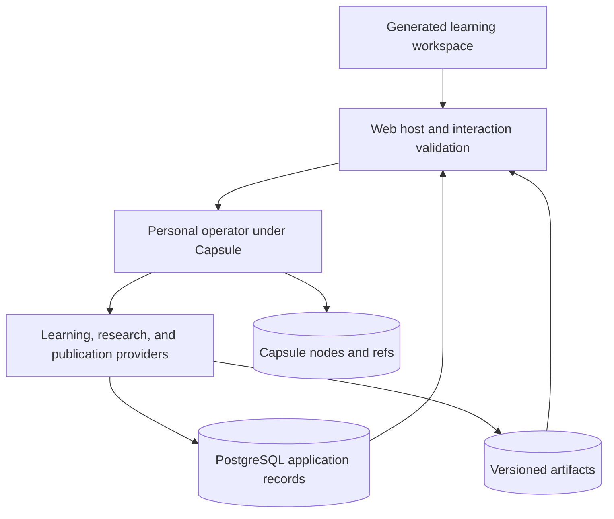

# PostgreSQL state and content-addressed artifacts

Status: proposed architecture, September 25, 2026. No schema migrations, data deletion, or application changes performed.

**Amended 2026-10-01 (#17):** the proposal below to write a PostgreSQL adapter for Capsule nodes and refs is replaced by upstream's conformance-tested one, `capsule_host::postgres::PgStorage`, in a `capsule` schema our migrations own. PostgreSQL also keeps application records and provider receipts keyed by effect id; casd is the fallback. See [capsule-integration.md](capsule-integration.md), "Revisit after Phase 1". Everything here about learning records, artifacts and transaction boundaries stands and was built in Phase 1.

Product architecture: [personal operator contract](operator-design.md). Companions: [learning experience and research](learning-design.md) and [preparation/readiness](preparation-plan.md).

## Decision being proposed

Keep the Rust domain/application/infrastructure structure as the host for a personal learning operator. Capsule governs that operator's execution and records its exchanges; PostgreSQL persists accepted application records, relationships, ownership, and queryable learning history. A PostgreSQL adapter can also implement Capsule's storage port. The operator constructs and evolves the harness described in the product contract; it is not merely a caller of a fixed quiz backend.

Distinguish two content-addressed stores: Capsule's immutable canonical nodes and mutable refs, and an application artifact store for PDFs, HTML, SVG, and other generated bytes. They may share physical infrastructure, but their schemas and address validation are distinct. Capsule nodes use the core's `cas_address` convention and encoding; a raw artifact is not a new core primitive. Compare-and-swap on refs is a separate concurrency operation.

Learning rules and provider contracts remain explicit and versioned. PostgreSQL enforces storage invariants and commits related application changes together. Capsule records provider requests and replies. A provider's database commit and the core's reply append are separate crash boundaries, addressed through stable effect identities and the supported recovery protocol. Moving state into persistence means that a process restart or page refresh cannot lose the meaning of a completed action.

## What exists today

Inspected at commit `3900c026ec9020c60261f603d9dfde84fc900fd3`; static source review, not a runtime verification.

| Finding | Evidence | Consequence for the redesign |
|---|---|---|
| PostgreSQL and SQLx are already configured | [pool](../backend/crates/infra/src/db.rs), [dependencies](../backend/Cargo.toml), [initial schema](../backend/migrations/20240101000000_initial.sql) | Retain the database foundation and redesign its model. |
| The quiz screen grades into React state | [Quiz.tsx](../frontend/src/pages/Quiz.tsx), `handleSubmit` | The main quiz path needs a persisted attempt command. |
| The quiz-session service stores `is_correct = false` | [quiz service](../backend/crates/app/src/services/quiz.rs), `submit_answer` | Consolidate the separate recording and grading paths. |
| A separate answer service compares strings and updates an RU | [question service](../backend/crates/app/src/services/question.rs) | Model attempts, assessments, and schedule changes explicitly. |
| The custom scheduler turns accumulated stability into answer quality | [RU service](../backend/crates/app/src/services/reinforcement_unit.rs), `compute_sm2` | Store the actual review outcome and scheduler inputs rather than treating accumulated score as recall quality. |
| RU rows combine claims, revision status, and learner scheduling | [entities](../backend/crates/domain/src/entities.rs) and initial schema | Separate content identity from a learner's evidence and schedule. |
| Uploads are written under a sanitized user/filename path | [upload service](../backend/crates/app/src/services/upload.rs) | Reusing a filename can replace earlier bytes; immutable addresses preserve source versions. |
| Claims, source locations, and events have initial schemas | [migration](../backend/migrations/20240103000000_claims_and_events.sql) | Keep provenance as a concept, while strengthening version references and transaction boundaries. |

The existing answer route authenticates but does not pass the authenticated user into its answer service. Ownership must be carried through the new commands and queries. This is a specific inspected gap, not a complete access-control audit.

## Persistence boundaries

| Information | Durable home | Behavior |
|---|---|---|
| Users, goals, library entries, ownership | PostgreSQL | Mutable records with constraints |
| Capsule execution transcript and session heads | Capsule storage port backed by PostgreSQL | Immutable verified nodes; refs advance through compare-and-swap |
| Operator charter, harness revisions, block catalog | Versioned application records and artifacts | Published configurations retain their provenance and prior versions |
| Document versions and source-span references | PostgreSQL | Version-specific identities and relationships |
| Original PDFs, extraction outputs, generated question/rubric payloads | CAS; indexed metadata in PostgreSQL | Immutable bytes; a change creates a new address |
| Concepts, objectives, prerequisite links, accepted revisions | PostgreSQL | Explicit scope and revision history |
| Presented questions, submitted answers, assessments, recall ratings | PostgreSQL; large attachments in CAS | Historical evidence is retained; corrections create new records |
| Current review schedule and learning summaries | PostgreSQL | Versioned projections from recorded evidence and policies |
| Workspace identity, reading position, publication jobs | PostgreSQL | Application lifecycle and durable work |
| Agent suspension, decisions, and continuation | Capsule record | Resume through the public SDK; do not build a second agent state machine |
| Search text, embeddings, dashboard aggregates | Rebuildable indexes/projections | Carry source and model versions |
| Open panel, hover, answer draft before submission | Browser | Temporary interaction state |

A source hash identifies bytes. It neither proves a claim true nor grants access to a document.

## A small relational model

These are logical groups, not a request to create every table in the first migration.

- **Artifacts:** `artifacts(cas_address, byte_length, media_type, schema_version, storage_locator)`. Relations and authorized ownership paths govern access.
- **Operator:** learner/workspace bindings, charter revisions, harness revisions, published block revisions, and change evaluations. Product IDs remain separate from Capsule session IDs and core node addresses.
- **Library:** `documents` provide stable user-facing identity; `document_versions` reference original artifacts; `extractions` record extractor/config versions and result artifacts; `source_spans` identify an extraction, page, and text offsets or bounding boxes.
- **Knowledge:** `concepts`, `learning_objectives`, and typed `concept_edges`; evidence links point to source spans. Content revisions and acceptance status are separate from learner state.
- **Practice:** stable `items` with immutable `item_revisions`, objective links, source evidence, and prompt/rubric artifact addresses. Keep recall cards distinguishable from explanation and application items.
- **Learning history:** `sessions`, ordered `session_items`, `attempts`, `assessment_revisions`, and `review_events`. Record assistance, submission time, displayed item revision, assessment method, and any self-rating.
- **Current state:** `review_state(learner_id, item_id, scheduler_version, parameter_revision, state, due_at, revision)` and objective-evidence summaries. A summary includes its input position and calculation version.
- **Work:** `jobs` with status, input identity, lease, retry count, and accepted result; notifications or external delivery can later use a transactional outbox.

Stable entity IDs answer “which item or document?” CAS addresses answer “which exact bytes?” Editing a question creates a new item revision. A substantial change in what a recall card asks may require a new learning item, even if the UI regards it as an edit.

Keep commonly filtered fields relational: learner, objective, due time, status, revision. Reserve JSONB for versioned payloads such as rubrics and scheduler-specific parameters. A generic JSON blob holding the entire app would obscure the constraints we want the database to enforce.

## Application artifact contract

Start with a local filesystem implementation behind an `ArtifactStore` port. PostgreSQL holds metadata and references. An object-storage backend can implement the same contract when deployment needs it.

This section concerns application bytes. The separate Capsule adapter must implement the public `Storage` contract for canonical nodes and compare-and-swap refs, without inventing its own node hashing format. The synchronous storage interface and SQLx execution strategy are an integration design task; see the preparation plan.

- Address the exact stored bytes using a versioned SHA-256 address representation. A layout such as `sha256/ab/<remaining-digest>` is an implementation option.
- Stream uploads to a temporary file while hashing; durably publish without overwriting an existing address. Verify any existing object before treating it as a successful duplicate.
- For structured artifacts, use a specified, versioned serialization before hashing. Preserve original upload bytes independently of normalized extraction output.
- Original filenames are display metadata. Identical names and different bytes produce different addresses.
- Record producer, input addresses, prompt/template version, model identifier, parameters, and actual output. A repeated model request can produce a different result; an input cache key is not the output's identity.
- Readers authorize through the document/item relationship before resolving an address. Use the same rule if physical bytes are deduplicated across users.

For the first release, published artifacts are retained and automatic garbage collection is disabled. Deletion and reference traversal need a defined policy before enabling collection.

### Crossing PostgreSQL and the artifact store

The filesystem and PostgreSQL do not share a transaction. Publish and verify the artifact first; then commit its metadata and domain references in PostgreSQL. A database rollback can leave an unreferenced object, which is acceptable while collection is disabled. Database state must never advertise an artifact whose publication has not completed.

Uploads use durable job/staging records to resume after interruption. Later garbage collection must respect live references, in-flight publications, retention policy, and races with new references. Backup and restore cover both PostgreSQL and the referenced artifacts; restoring only the database is incomplete.

For very small deployments, a PostgreSQL `bytea` CAS backend is also possible and would simplify atomic publication. The filesystem proposal keeps large source files outside ordinary relational backups, at the cost of coordinating two stores. Choose the physical backend at the first CAS implementation checkpoint.

## Provider transactions follow user actions

The existing repository methods often commit individual table operations through a pool. Replace the relevant paths with provider-backed operations that own the application unit of work, such as `record_review`, `publish_document_version`, and `publish_generated_item`. These are proposed application operations, not new Capsule SDK methods.

The personal operator chooses and adapts the permitted workflow. Provider transaction adapters load the required state, invoke domain transitions, and commit the resulting application records together. They must not duplicate grading or scheduling rules in SQL and Rust. Retain simple read queries where they are useful; remove interfaces that only obscure a single query.

### Submit an answer

1. Receive the session-item identity, exact displayed item revision, answer, assistance markers, and a client submission key.
2. In a short transaction, verify ownership and session membership, create the immutable attempt, and either assess deterministically or enqueue a durable assessment job.
3. If assessment requires an external model, perform that work outside the database transaction. Save the response artifact before finalization. Pending or failed assessment is not an incorrect answer.
4. Finalization verifies the worker lease and that the attempt has not already been finalized, then inserts the assessment and any eligible review event and updates relevant projections atomically.
5. Return the persisted result and a stable receipt identifying the accepted records and revisions. A retry with the same key and payload returns the existing outcome; the same key with different content is rejected. Capsule records the provider reply separately.

When invoked by the operator, associate the application command with the Capsule effect identity. An interrupted call may have committed in PostgreSQL before its reply reached the core. Reconciliation must look up the existing receipt through the supported recovery path; it must not blindly resubmit an uncertain effect. A client submission key also identifies the user's logical action across HTTP retries.

Use uniqueness constraints for command identity and accepted assessment publication, plus locks or checked revisions for competing state updates. PostgreSQL documents [row locking](https://www.postgresql.org/docs/18/explicit-locking.html) and [uniqueness/foreign-key constraints](https://www.postgresql.org/docs/18/ddl-constraints.html); these are the primitives, while the workflow above is our design.

For stable recall cards, record the learner's actual recall rating. An LLM score on an explanation should not silently become an FSRS rating. Scheduler updates use a defined per-learner/item review order. Late assessments or corrections require recomputing affected projections in that order, rather than applying an old result as the newest review.

Persist review time, algorithm version, and parameter revision. Rebuilding a schedule uses those saved inputs, without calling a model or using the current wall clock as the original review time.

### Daily session and background work

Create a daily session and its ordered item-revision list transactionally. Refresh resumes it. A new session can select fresh variants while old sessions preserve the exact questions shown. Due work comes from persisted schedules and eligible items, rather than an RU status badge.

Initially use a PostgreSQL jobs table and one worker process. Lease jobs in short transactions; recover expired leases. `FOR UPDATE SKIP LOCKED` is suitable for competing queue consumers, with the inconsistent-view caveat in PostgreSQL's [SELECT documentation](https://www.postgresql.org/docs/18/sql-select.html). It is not a substitute for correctness in general-purpose reads.

Application jobs that are explicitly retryable use at-least-once execution and idempotent publication. Store an attempt/lease token so an expired worker cannot overwrite a newer job result. Capsule effects with uncertain delivery follow the core's recovery contract; a generic jobs retry policy must not override it.

## History, current state, and corrections

Use append-only learning evidence with ordinary relational current state. We do not need to rebuild the entire application from a generic event bus on every read.

Ownership of truth is explicit: Capsule's transcript establishes which forms and external replies the operator observed; the application records establish accepted attempts, assessments, published artifacts, and harness revisions. Stable receipts tie the two together. A recorded provider reply is not proof that an educational judgment is correct.

Authoritative records include document/item revisions, attempts, accepted assessments, recall ratings, and policy versions. Schedules and learning summaries are derived. Derived projections can be repaired from the relevant records without regenerating questions or repeating tutoring calls.

A disputed grade creates a new assessment revision and an explicit correction decision. Preserve the original attempt and historical feedback. Recalculate affected summaries and schedules using the accepted correction. Keep audit records distinct from durable jobs that still need execution.

## Keep, replace, remove

| Keep | Replace | Remove when its replacement is working |
|---|---|---|
| Axum, SQLx, PostgreSQL, Rust layer boundaries | Filename-based uploads with versioned artifact references | Unused CRUD wrappers and obsolete endpoints |
| Useful reader and UI components | Browser-only quiz results with persisted submissions | Duplicate grading paths |
| Concepts and source provenance as domain ideas | RU content/state mixture with items, evidence, and learner state | Heuristic “mastery” labels unsupported by evidence |
| Existing migrations as a record of the current database | Fragmented writes with action-level transactions | Old scheduling columns after migration or clean-database cutover |

The owner permits pruning code. Existing live data requirements are still unknown. Development can use a new isolated database while we decide whether to migrate old records; no existing database needs to be dropped to review or implement the new design.

## Implementation sequencing

Follow the [hardening-first plan](hardening-plan.md): establish the application baseline, close ownership/configuration gaps, and prove one persisted learning flow with source versions and retry-safe attempts. Then implement Capsule storage and providers over those same application operations, followed by richer operator-driven workspaces. The earlier preparation sequence is superseded.

Each implementation and test diff follows the owner's review/explanation checkpoint before the next change or commit. This document is a design proposal; none of those implementation steps has started.
