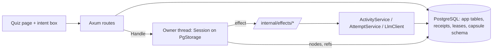

# Phase 2 build plan: the operator loop

October 1, 2026. Scopes the Phase 2 tickets (#18, #19, #20) and the first Phase 3 slices that the operator UX ruling and the guided-reading design call for. Decisions it rests on: [capsule-integration.md](capsule-integration.md), "Revisit after Phase 1" and "Learner UX for Phase 2"; the product in [operator-design.md](operator-design.md); the pedagogy in [learning-design.md](learning-design.md). Capsule pin `4b77dcc`; the working constraints of the hardening plan apply to every ticket.

## Why this exists (owner, 2026-10-01)

Two purposes, both real, no revenue. First, **StudyBuddy is the demonstration of Capsule Core**: that this kind of long-running, source-bound, recoverable agent work is built with relative ease from small capsule blocks. Second, **the owner is the first learner**, using it to become an RL expert for the Neural Routing thesis. The two keep each other honest: the demo is only convincing if the learning is real, and the learning only happens if the loop actually runs.

Consequences for every ticket below:

- **The capsule source is the product.** Each block (present, wait, hint, locate, critique, assess, plan) is a capsule or verb that fits on one screen and reads as what it does. Legibility of `backend/capsules/*.capsule` and the environment template outranks frontend polish.
- **The gate demos are the deliverable.** `gate-demo.md` and its script are the pattern: a narrated run anyone can execute that shows a crash and a recovery, a refused scope, a replay that asks no provider. Gate 2 and gate 3 are written for a reader who wants to see what Core does, not a user who wants a nicer page.
- **Frontend stays minimal on purpose.** The quiz page, an intent box, a hint control, a span beside the question. Nothing that does not show a Core capability or serve the owner's own study.
- **Real sources, real study.** The first workspace is the owner's RL reading list; the gate 2 and gate 3 runs use those uploads, so every demo doubles as a study session.

## What ships at the end of Phase 2

A learner types one intent into an empty workspace and is answering a source-cited activity within one screen. Each accepted attempt wakes the operator, which publishes the next activity without being asked. A process kill at any point reopens with nothing lost and nothing published twice. The frontend is the existing quiz page plus an intent box and a hint control. No scheduling policy, mastery judgement, export, generated interface or code execution.

## The one architectural choice: embed now, launcher-ready

Upstream's **L1 launcher** (one binary: environment file, capsule refs, a connector manifest binding families to providers, opens the session on storage, runs the owner's loop) is planned and not started. Waiting for it would idle Phase 2 on an unknown date, and its connector types are not yet defined, so we cannot target them.

We **embed** `capsule_host::owner::Owner` in the backend process now, and we shape every provider as a **thin HTTP endpoint on the backend** rather than a Rust closure that reaches into services directly:

```text
POST /internal/effects/{family}      body: { effectId, capability, payload }   -> reply JSON
```

Idempotent by effect id (the receipt table), authenticated by a process-local secret, bound to a workspace by the session's identity, never reachable from the browser. The embedded owner's providers are one-line clients of these endpoints over loopback. When L1 ships with any HTTP-shaped connector, the launcher replaces the embedded owner and **no provider changes**; if L1 never fits, nothing was lost but one hop on loopback. This is the only place Phase 2 bets on upstream's direction, and the bet is hedged.



## Tickets, in order

Each is one PR, small, with a reading-order guide. Sizes: S under 200 lines, M under 500, L needs a split.

| # | Ticket | Size | Lands live |
| --- | --- | --- | --- |
| 18a | **Pin and schema.** Probe pin to `4b77dcc`, lockfile; migration for the `capsule` schema (`nodes`, `refs`) exactly as `PgStorage` expects, plus `effect_receipts (effect_id PK, workspace_id, family, payload JSONB, recorded_at)` and `workspace_sessions (workspace_id PK, session_name, owner_lease UUID, lease_until)`. | S | Tables exist; probe green on the new pin. |
| 18b | **Open and reopen on Postgres.** A `capsule_host` dependency with the `postgres` feature; an `OperatorHost` module that spawns one `Owner` per workspace on demand, opening `PgStorage::existing` on the owner thread with its own pool, holding the lease row. Test: open, run the probe's capsule with scripted providers, kill the owner, reopen from the database, same record. | M | A session survives a restart on the real database. |
| 18c | **Receipts and the four crash points.** `complete` by effect id from the receipt table on reopen. Test per crash point: before dispatch (deny), during possible delivery (`Unknown` then complete from receipt), after the domain commit, after the reply is recorded (`Already`). Scripted providers, real Postgres. | M | Recovery proven where it will run. |
| 19a | **Effect endpoints.** `/internal/effects/learning.present` and `/internal/effects/learner.attempt` calling `ActivityService::create` and `AttemptService::get` inside one transaction with the receipt insert; process-local auth; workspace binding. Test: the manual route and the endpoint write identical rows for the same input; a replayed effect id returns the stored receipt and writes nothing. | M | Providers exist and are idempotent. |
| 19b | **The model provider.** `/internal/effects/model.call` over the #6 `LlmClient`; no provider credentials in the payload; timeout and 502/504 mapped to `Reply::Declined`/`Unknown` per the H3 ruling. | S | The capsule can think. |
| 19c | **Learning capsule v1.** The probe's capsule moved into `backend/capsules/learning.capsule` with the environment template scoped to `workspaces/<id>/*`, verbs `present`, `wait`, `finish`, model-proposed follow-ups; compiled and pinned by ref at startup. | S | The program the operator runs is in the repo. |
| 20a | **Goal and start.** `POST /api/workspaces/{id}/goal` stores the intent as goal revision 1 and starts the run (`run_once` keyed by goal revision id). `GET /api/workspaces/{id}` returns goal, current activity id, operator state (`thinking`, `waiting`, `idle`). Frontend: the intent box on an empty workspace, nothing else. | M | Intent in, first activity out. |
| 20b | **Answer wakes the operator.** On an accepted attempt against an operator-published revision, the route completes the `learner.wait` park by effect id from the attempt receipt; the owner runs on; the next `present` publishes. Frontend: the quiz page polls workspace state and shows the new activity. | M | The loop closes. |
| 20c | **Hint.** `POST /api/attempts/drafts/{revisionId}/hint` asks the operator (a `learner.hint` effect served by the model provider), returns text, and the attempt that follows records it as assistance. Frontend: one control on the card, labelled. | S | Assistance exists and is recorded. |
| 20d | **Gate 2.** `scripts/operator-demo.sh`: intent, first activity, answer, follow-up, kill the backend mid-think, restart, same follow-up, no duplicate. Doc like `gate-demo.md`. | S | Phase 2 is demonstrated, not claimed. |

Order: 18a → 18b → 18c → 19a → 19b → 19c → 20a → 20b → 20c → 20d. 19a can start after 18a since it needs only the receipt table.

## First Phase 3 slices this unlocks

Filed now so the Phase 2 work keeps their data in reach; built after 20d.

| Ticket | Slice |
| --- | --- |
| **Source spans** | A revision's `source_location` becomes `{page, start, end}` the quiz page renders beside the question from `/api/resources/{id}/pages`, so the learner reads the passage inside the activity. Pretests and gated passages are then just activities. |
| **Source navigator** | At upload, derive a structure tree (headings with page ranges) from the page text and store it on the resource. A read-only `source.locate` effect walks the tree with the model and returns page ranges, the vectorless-RAG pattern; the operator cites them. Shaped as upstream's reader child once delegation is exercised. |
| **Assessed explanations** | `assessments.method = model` for `explain` activities, produced by the operator after the attempt, never by the publication path; pending until then. |
| **Delayed re-tests** | Items answered with assistance or recently return unaided at preselected times via the clock-source park and timekeeper (T1, T2). |

## Not in this plan

Row-level security (#31, deferred). Mastery, due dates, streaks (#14 stands). Exports. Generated interfaces. Web research. Code execution. Multiple owners per session or multi-process deployment: one backend process holds every lease; the lease row is what makes a second process refuse, not scale.

## Risks, each with its tell

- **L1 lands with a connector shape the endpoints do not fit.** Tell: its manifest binds providers by something other than a URL. Cost: an adapter binary, providers unchanged.
- **`PgStorage` on the owner thread contends with the app pool.** Tell: lock waits on `capsule.refs`. Cost: none expected; separate pool, separate tables, one writer.
- **The model provider is slow and the HTTP request waits on it.** Prevented by design: routes return workspace state, never a run result; the owner thinks off the request path.
- **Upstream moves the SDK again.** Tell: the probe fails on a pin bump. Cost: known, since the probe is our canary and runs in CI.
